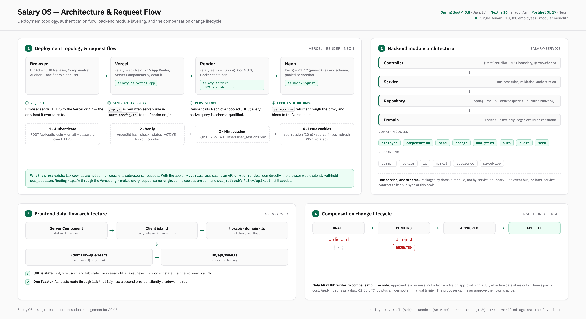

# Salary OS

Single-tenant compensation management for ACME — 10,000 employees, multiple countries, one
authoritative record of what everyone is paid.

| Piece | Tech | Responsibility |
|---|---|---|
| `salary-service/` | Spring Boot 4.0.8 (Java 17+) | Domain, persistence, auth, analytics, seeding |
| `salary-web/` | Next.js 16 (App Router) + shadcn/ui | The only user interface |

## Architecture

Deployment topology, the authentication flow, backend module layering, and the compensation
change lifecycle, on one page:



Print-quality version: [`docs/architecture/salary-os-architecture.pdf`](docs/architecture/salary-os-architecture.pdf).

## Documentation

| Read this | For |
|---|---|
| `requirements-one-pager.md` | Scope contract — goal, the seven questions, exclusions |
| `Technical-Requirements.md` | FR/NFR, data model, API contract, acceptance criteria |
| `CLAUDE.md` | Architecture, auth model, cross-cutting invariants, conventions |
| `BuildPlan.md` | Build tracker — the first `[ ]` step is what happens next, done-notes for every completed one |
| `docs/salary-management-backend.md` | **Binding** for `salary-service/` |
| `docs/salary-management-ui.md` | **Binding** for `salary-web/` (design system) |
| `docs/STATE.md` | Current build state, decisions, and gotchas |
| `docs/architecture/salary-os-architecture.png` / `.pdf` | Architecture & request-flow diagram (above) |

Read one section instead of a whole doc: `scripts/doc.sh ui 7.1` · `scripts/doc.sh be 2.3` ·
`scripts/doc.sh toc ui`.

## Running locally

There is no Neon project yet (`P0.3` in `BuildPlan.md`) — everything below runs against a local
Postgres 17 in Docker instead. `salary-service/src/main/resources/application-local.yml.example`
is a *different*, Neon-shaped template for when that project exists; don't copy it verbatim for
this local setup — the block below is what actually works today.

**Prerequisites:** Java 17+, Node 20+, Docker (or a Docker-API-compatible runtime — this project
was built against [colima](https://github.com/abiosoft/colima) on macOS).

### 1. Postgres

```bash
docker run -d --name salaryos-devdb -e POSTGRES_PASSWORD=devpass -e POSTGRES_DB=salaryos \
  -p 5433:5432 postgres:17
```

### 2. Backend

Create `salary-service/src/main/resources/application-local.yml` (git-ignored — never commit
this file):

```yaml
spring:
  # Overrides application.yml's P0.2 stub, which excludes persistence autoconfiguration entirely
  # until a real DATABASE_URL exists (P0.3) -- without this override the app starts cleanly with
  # Flyway silently never running, which is the worst way to find out.
  autoconfigure:
    exclude: []
  datasource:
    url: jdbc:postgresql://localhost:5433/salaryos
    username: postgres
    password: devpass
    hikari:
      maximum-pool-size: 10
      connection-timeout: 10000
      max-lifetime: 300000
  jpa:
    open-in-view: false
    hibernate:
      ddl-auto: validate
    properties:
      hibernate:
        default_schema: salary_schema
  flyway:
    enabled: true
    schemas: salary_schema
    default-schema: salary_schema
    locations: classpath:db/migration
    user: postgres
    password: devpass

app:
  cors:
    # Must match whatever port you run salary-web on in step 3 — the frontend calls the API
    # directly from the browser (not through a Next.js proxy), so a mismatch here is a CORS
    # failure, not a 401/403 (the browser blocks the request before it reaches the server).
    allowed-origins: http://localhost:3100
```

First run, with seeding (10,000 employees, ~50k comp records, ~17s):

```bash
cd salary-service
./mvnw spring-boot:run -Dspring-boot.run.profiles=local,seed
```

Flyway migrates the schema automatically. Watch the console for the seeded login credentials
(printed once — see below) and the seed summary. Subsequent runs, once seeded, drop the `,seed`:

```bash
./mvnw spring-boot:run -Dspring-boot.run.profiles=local
```

Re-seeding requires an empty `employees` table (it refuses otherwise) or `--app.seed.force=true`
appended to the command — force does **not** clear existing data first, so truncate manually if
you actually want a fresh reseed:

```bash
docker exec salaryos-devdb psql -U postgres -d salaryos -c "
truncate table salary_schema.employee_current_comp, salary_schema.compensation_components,
  salary_schema.compensation_records, salary_schema.compensation_changes,
  salary_schema.employee_demographics, salary_schema.employees, salary_schema.salary_bands,
  salary_schema.fx_rates, salary_schema.users, salary_schema.job_levels,
  salary_schema.job_families, salary_schema.departments, salary_schema.locations,
  salary_schema.countries restart identity cascade;"
```

### 3. Frontend

```bash
cd salary-web
cp .env.example .env.local   # NEXT_PUBLIC_API_BASE_URL=http://localhost:8080
npm install
npm run dev -- -p 3100       # port must match app.cors.allowed-origins above
```

Open `http://localhost:3100` and sign in.

### Seeded credentials

`SeedRunner` is fully deterministic (`APP_SEED_RANDOM_SEED`, default `20260820`) — two seed runs
against empty databases produce byte-identical data, credentials included (`P9.2` proves this).
With the default seed, these are the six accounts every seed run produces:

| Email | Password | Role |
|---|---|---|
| `admin@acme.test` | `harbor-orbit-4853` | HR_ADMIN |
| `manager@acme.test` | `compass-harbor-4362` | HR_MANAGER |
| `analyst@acme.test` | `beacon-signal-8656` | COMP_ANALYST |
| `auditor@acme.test` | `harbor-quartz-6393` | AUDITOR |
| `jordan.manager@acme.test` | `compass-compass-7982` | HR_MANAGER |
| `priya.manager@acme.test` | `granite-granite-5520` | HR_MANAGER |

If `APP_SEED_RANDOM_SEED` is overridden, these passwords change — the authoritative copy is
always whatever `SeedRunner` prints to the console on that run (`==== SEEDED LOGIN CREDENTIALS
(shown once) ====`), not this table.

## The seven questions

`requirements-one-pager.md`'s scope contract, and where each is answered in the running app:

| # | Question | Where |
|---|---|---|
| 1 | What do we spend on base pay — total, by country, department, job level? | `/insights/pay` — payroll cost card |
| 2 | Who is paid outside their band, and what would it cost to fix? | `/insights/pay` — out-of-band section |
| 3 | What does the compa-ratio distribution look like by department and level? | `/insights/pay` — compa-ratio histogram |
| 4 | For the same level and location, do groups get paid differently? (aggregate only) | `/insights/equity` — pay-gap screen |
| 5 | What did the last increase cycle cost, how much merit budget is left? | `/` (dashboard) — increase-cycle card |
| 6 | Before I approve this raise, how does it compare to peers? | An employee's page → "Propose change" → the dialog's live impact panel (delta, compa-ratio, peer percentile), and `/employees/{id}` → Peers |
| 7 | What is this one person's full pay history — every change, when, why, by whom? | An employee's page → Pay History |

## Acceptance status

All twelve of `Technical-Requirements.md §6`'s acceptance criteria were walked live against
seeded data at build step `P9.6` — the full criterion-by-criterion result (what was demonstrated
and the exact observed output) is in `BuildPlan.md`'s P9.6 done-note. **11 of 12 pass.** The
employee list's missing band-status filter and compa-ratio sort (criterion #2) were closed in a
post-P9 pass — both are server-side over the full 10k dataset (`bandStatus`/`sortBy=compaRatio` on
`GET /api/employees`), not a client-side filter of one page. The one remaining gap: analytics
responses don't carry an `fxRateMonth` field — a deliberate design decision explained in
`PayrollCostResponse`'s own javadoc (an aggregate spanning many employees has no single governing
FX month to report), not an oversight, but one that conflicts with criterion #8's literal wording.
`docs/STATE.md` carries the same summary as an open product decision for whoever picks this up
next.

## Status

Build progress is tracked in `BuildPlan.md`. See its Progress log for the current step.
